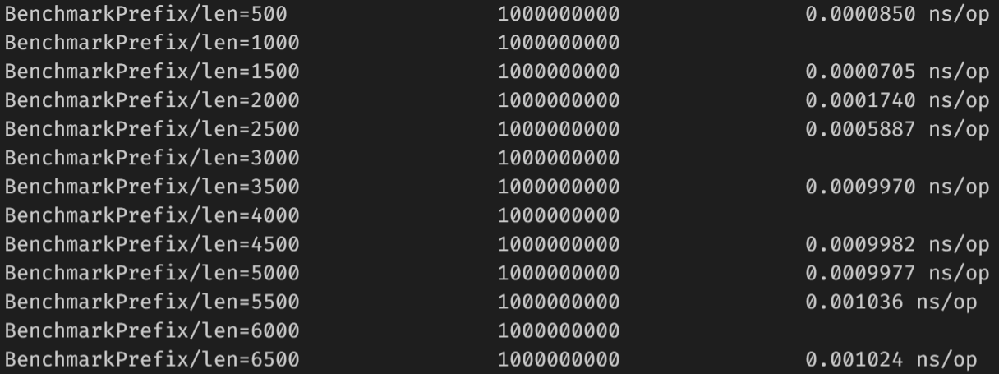
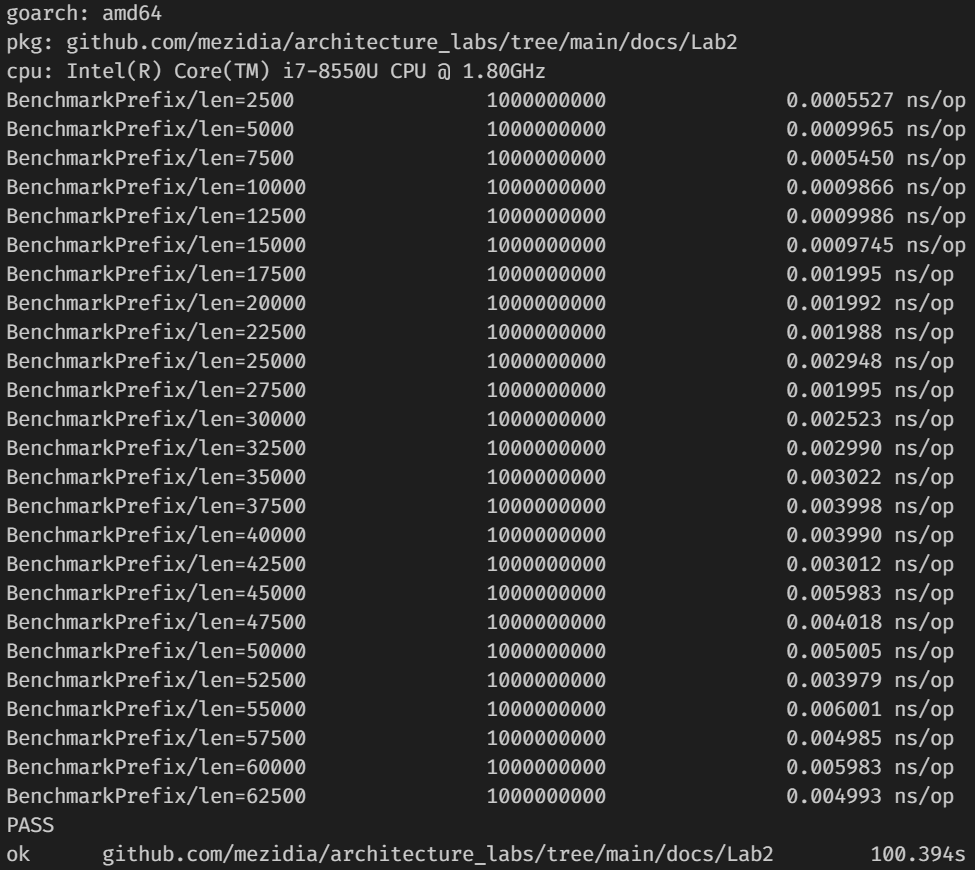
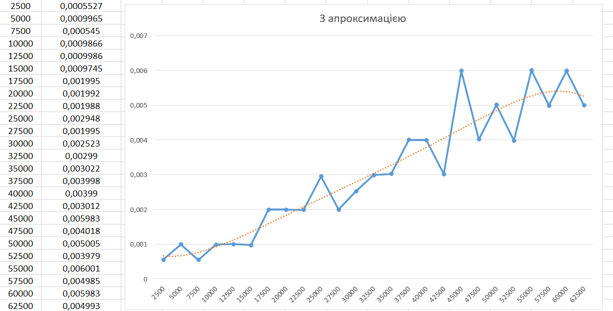
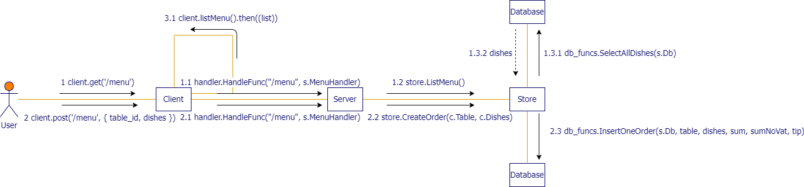

# Архітектура програмного забезпечення

## Розрахункова-графічна робота

### **Тема**: Архітектурні діаграми та бенчмарки

### **Мета**: Закріплення навичок ілюстрації організації програмних систем та оцінки часу виконання алгоритмів

---

### Виконали студенти групи ІП-93:
- Василіненко Нікіта Максимович
- Дмитренко Роман Вадимович
- Домінський Валентин Олексійович
- Завальнюк Максим Євгенович

---

### Зміст

- [Завдання](#Завдання)
- [1-ше завдання](#1-ше-завдання)
- [2-ге завдання](#2-ге-завдання)
- [3-тє завдання](#3-тє-завдання)

### Завдання

- Для 2-гої роботи, підтвердьте лінійний час виконання вашої функції перетворення чи обчислення вхідного виразу

- Для 3-тої роботи, побудуйте діаграму взаємодії компонентів у вашій імплементації

- Для 4-ої роботи, побудуйте діаграму взаємодії для вашої реалізації (на ній, скоріш за все, мають опинитися компоненти парсера, черги команд, ядра цикла) та підтвердьте лінійний час роботи вашого парсера команд

---

## 1-ше завдання

Наш варіант - №3 - Обчислити префіксний вираз

Щоб підтвердити лінійний час виконання даної функції, ми підготуємо бенчмарк для неї, запускаючи функцію для даних різного розміру (постійно їх збільшуючи)

[Код нижче](https://github.com/mezidia/architecture_labs/blob/main/docs/Lab2/bench_test.go) запускає функцію **[Prefix](https://github.com/mezidia/architecture_labs/blob/main/docs/Lab2/implementation.go)** 25 разів, передаючи їй вхідний рядок різного розміру. Кожен запуск оформлено у вигляді окремого дочірнього бенчмарка, що дає можливість отримати середній час виконання функції для кожного з розмірів

Результат виконаня та помилка функції зберігається у глобальних змінних пакет та err. Їх єдине призначення - уникнути оптимізації компілятора

```go
package lab2

import (
	"fmt"
	"testing"
)

var startStatement string = "+ - / * 1 2 3 4 5"
var cntRes int
var err error

func BenchmarkPrefix(b *testing.B) {
	const baseLength = 2500

	for i := 0; i < 25; i++ {
		input := startStatement
		iterationsNum := baseLength * (i + 1)

		for j := 0; j < iterationsNum; j++ {
			input = "+ " + input
			input = input + " "
			input = input + startStatement
		}

		b.Run(fmt.Sprintf("len=%d", iterationsNum), func(b *testing.B) {
			cntRes, err = Prefix(input)
		})
	}
}

```

---

Ми маємо певний початковий вираз "+ - / * 1 2 3 4 5", який будемо повторювати N разів (і додавати на початок знак "+", аби зберігалася префіксна форма) та передавати як аргумент до методу Prefix. Початковим N було обрано 2500, оскільки при меншій к-сті на деяких ітераціях усе відбувається швидко і ми не отримуємо результати. Як, наприклад, тут, де baseLength = 500:



---

Запуск бенчмарка дає нам такі результати:



---

Якщо перенести ці дані та відобразити їх на графіку, то отримаємо таку картину:


Можна помітити кілька речей:
1. Значення X не завжди більше X-1. Наприклад на позначці 7500 X = 0,000545, коли його попередник на 5000 - 0,0009965. Здавалося б, вхідна стрічка збільшилася, а час - зменшився. Як так?
Пояснити це можна тим, що тестування проводилося не в ідеальних умовах. Певно в один момент навантаження на ПК було більше/менше, через ПЗ, яке працювало паралельно з нашими обчисленнями
2. Незважаючи на пункт 1, загалом графік йде вгору прямою лінією, що видно з наступного малюнку, де була використана апроксимація



---

## 2-ге завдання



Пояснення до діаграми:

1. Усе починається від користувача. Він може перейти за адресою `/menu` двома методами запиту: "*Get*", "*Post*". Тому кліент відслідковує це(**1** та **2**).
2. У самого кліента завжди відображається список усіх замовлень(**3.1**).
3. Залежно від запитів від кліенту до серверу спрацьовують дві функції: **1.1** та **2.1**.
4. Далі сервер звертається до *Store* відповідно - **1.2** та **2.1**.
5. У першому випадку *Store* надсилає запит до *Database* **1.3.1**, щоб отримати усі страви, та отримує їх(**1.3.2**).
6. У другому випадку *Store* надсилає запит до *Database* **2.3**, щоб створити замовлення, але вже не отримує ніякої відповіді(хіба що помилку).

---

## 3-тє завдання

Приклад коду:
```go
package lab4

import (
	"fmt"
	"testing"

	"github.com/mezidia/architecture_labs/tree/main/docs/Lab4/engine"
)

var txt = "print script"
var cntRes engine.Command

func BenchmarkCount(b *testing.B) {
	const baseLen = 7500
	for i := 0; i < 16; i++ {
		input := txt
		l := baseLen * (i + 1)

		for j := 0; j < l; j++ {
			input = input + "sadstoryline"
		}

		b.Run(fmt.Sprintf("len=%d", l), func(b *testing.B) {
			cntRes = Parse(input)
		})
	}
}

```

Результат виконання benchmark-тестів:


Графік по точкам:


Графік по точкам з апроксимацією:


Як бачимо, протестувавши час виконання функції parser з 4-ої лабораторної роботи, лінійний час її роботи було підтверджено.
